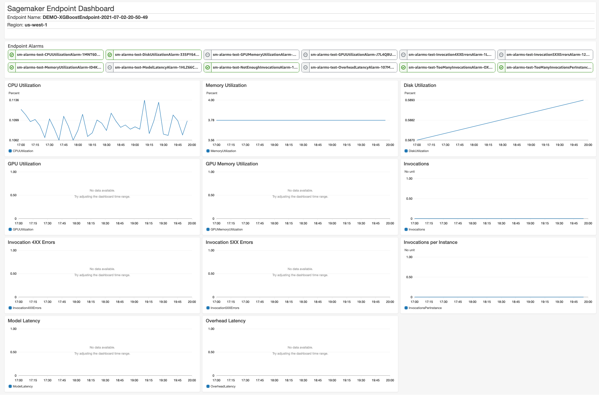

# Infrastructure for operational monitoring of SageMaker Endpoints

### Introduction

This repository contains cloudformation template for creating CloudWatch Alarms and Dashboard for monitoring a single SageMaker endpoint.

Currently it includes Alarms and Dashboard widgets for monitoring **Operational** aspect of SageMaker endpoints (such as CPU Utilization, Memory Utilization, Latency, etc.) however it can be extended to monitor other metrics such as Data and Concept Drift.

Alarm notifications are published to an SNS topic created as part of the CloudFormation template. You can subscribe multiple consumers to this topic. For example you can subscribe an email address to get notified in case an alarm is trigerred.

For each alarm, [Threshold](https://docs.aws.amazon.com/AWSCloudFormation/latest/UserGuide/aws-properties-cw-alarm.html#cfn-cloudwatch-alarms-threshold), [Period](https://docs.aws.amazon.com/AWSCloudFormation/latest/UserGuide/aws-properties-cw-alarm.html#cfn-cloudwatch-alarms-period) and [EvaluationPeriods](https://docs.aws.amazon.com/AWSCloudFormation/latest/UserGuide/aws-properties-cw-alarm.html#cfn-cloudwatch-alarms-evaluationperiods) can be configured as parameter when deploying the Cloudformation stack.

This stack is for monitoring one SageMaker endpoint however you can easily modify it for multiple endpoints or deploy a separate stack per endpoint.

#### Included Metrics

This cloudformation template includes Alarms and Dashboard widgets for the following metrics:

- CPUUtilization
- MemoryUtilization
- DiskUtilization
- GPUUtilization
- GPUMemoryUtilization
- Invocations
- Invocation4XXErrors
- Invocation5XXErrors
- InvocationsPerInstance
- ModelLatency
- OverheadLatency

For detailed description of each of these metrics refer to the [Official AWS Documentation](https://docs.aws.amazon.com/sagemaker/latest/dg/monitoring-cloudwatch.html).

#### Screenshot of the Cloudwatch Dashboard

### Deployment Instruction

- Clone the repository.
- Navigate to the Cloudformation Console and select the region in which the Sagemaker endpoint is located at.
- Navigate to the Cloudformation Page
- Click on "Create Stack" -> "With new resources (standard)"
- Select "Template is Ready" and "Upload a template file"
- Choose the template.yml file from the cloned repository.
- Enter the values for the parameters and modify the settings as needed.
- Navigate to the next steps and Deploy the stack.

### Access to the Dashboard

Once the stack is deployed, navigate to the stack's Outputs tab and click on the value for the output named "DashboardUrl".
Alternatively, you can navigate to Cloudwatch -> Dashboards and then select the newly created dashboard.

### Modifying the Dashboard:

Recommended approach for modifying the dashboard is through the code to ensure it's reproducable and can be version controlled. (Infrastructure as Code) via the follwing steps:

- Update the cw-dashboard.json with the changes. (Tip: You can update the dashboard manually in console then click on "edit/view source" to see how the code looks like)
- Minify the json to look similar to the cw-dashboard-minified.json (Remove the new lines).
- Update the value for the "DashboardBody" property of "EndpointMonitoringDashboard" Resource in the template.yml file with the minified json and update the stack.

Alternatively, you can manually modify the Cloudwatch dashboard through the console.

#### Developer: [Iman Kamyabi](https://www.linkedin.com/in/imankamyabi/)
